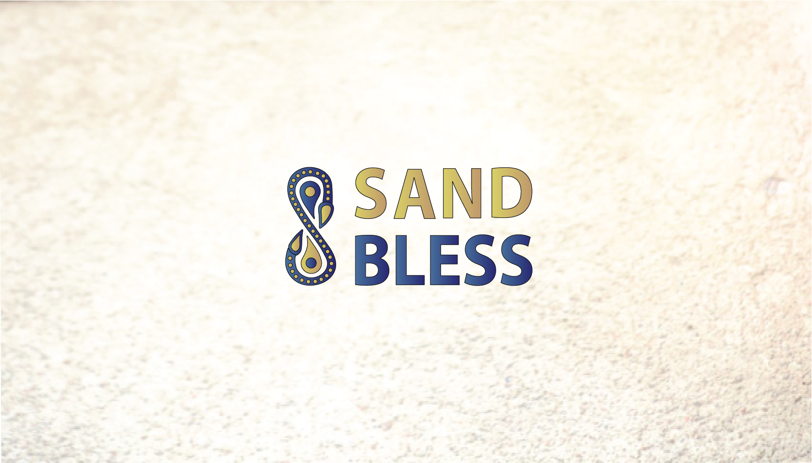
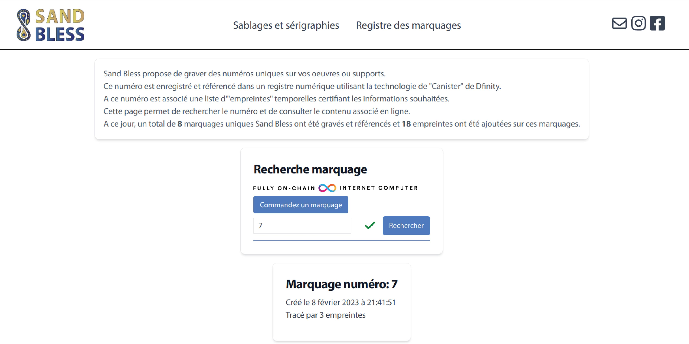
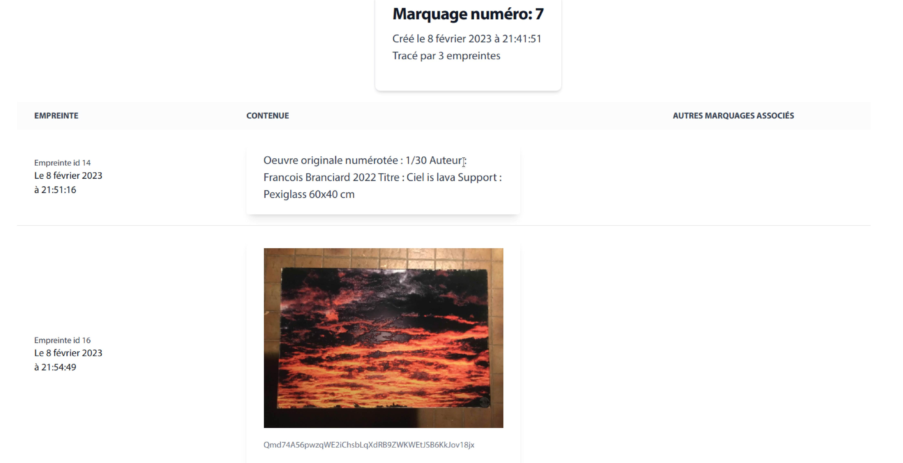
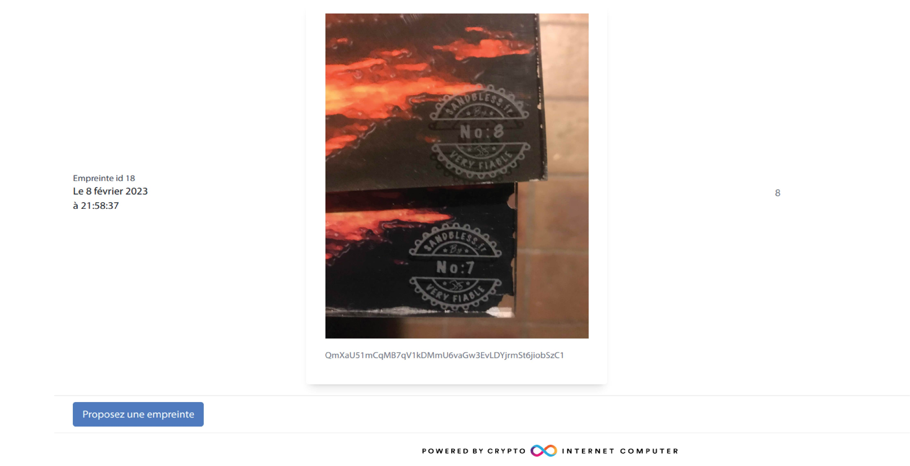

<p align="left" >
  
</p>

# Sand Bless

Project bootstrap at Supernova Dfinity hackathon. See details [here](./SupernovaHackthon2022.md)


Deployed at [sandbless.fr](http://sandbless.fr)

Create and search marks number to engrave on artwork:

<p align="left" >
  
</p>

Add imprints linked to marks number to track story and certifictions of the artwork:

<p align="left" >
  
</p>

<p align="left" >
  
</p>

## Install dependencies

Make sure you have [node.js](https://nodejs.org/) installed.

### DFX

Install `dfx` by running

```
sh -ci "$(curl -fsSL https://smartcontracts.org/install.sh)"
```

### Rust

To compile a local version of Internet Identity, you need to have [Rust](https://www.rust-lang.org/learn/get-started) installed.

Also install that target `wasm32-unknown-unknown` by running the command:

```
rustup target add wasm32-unknown-unknown
```

## Start the local replica

Open a new terminal window _in the project directory_, and run the following command to start the local replica. The replica will not start unless `dfx.json` exists in the current directory.

```
dfx start --background
```

When you're done with development, or you're switching to a different dfx project, running

```
dfx stop
```

from the project directory will stop the local replica.

## Install Internet Identity

To use Internet Identity during development you need to have it running on your local replica. This repository includes it in a submodule.

To clone the II repository, run:

```
git submodule update --init --recursive
```

When the repository is cloned, switch to its directory and install it:

(If you're running this on an M1 Mac, make sure you follow [these steps]())

```
cd internet-identity
npm install
II_FETCH_ROOT_KEY=1 dfx deploy --no-wallet --argument '(null)'
```

This will take several minutes to complete.

## Build & run the dapp

Make sure you switch back to the project root directory.

First, install the frontend dependencies by running

```
cd src/frontend
npm install
cd ..
```

To build and deploy the project run


dfx deploy --argument "(
  record {
    createdBy = principal\"$(dfx identity get-principal)\";
    custodians =   vec {
          record { custodianPrincipal = principal\"t3qqj-3ii2v-jyyav-cfs4v-x5msl-fgalg-pgcp4-xw3aq-doz7v-rulem-6qe\"};
          record { custodianPrincipal = principal\"jlji3-icrvc-44wgv-2tppf-tigpq-n5iw6-ool5p-fetb3-ztw2n-s6ano-zae\"};
          record { custodianPrincipal = principal\"7ruib-t37yg-luios-6pd65-fu7t6-q27b7-dmfhp-dgciv-hgdk6-i55mi-kqe\"};
        }
  }
)"


When the process completes you'll have a backend and a frontend canister running locally. To find the frontend canister's ID, run

```
dfx canister id frontend
```

It will output something similar to `rno2w-sqaaa-aaaaa-aaacq-cai`. Copy this ID and open it in the browser using `http://localhost:8000?canisterId=<canister ID>`, eg. `http://localhost:8000?canisterId=rno2w-sqaaa-aaaaa-aaacq-cai`.

## Local development

During local development you will be building and deploying the Motoko backend to the local replica. Building the backend will generate so called declaration files, that are Candid and JavaScript files helping the frontend communicate to the back end.

### Motoko back end

If you're using Visual Studio Code it is recommended to use the [Motoko extension](https://marketplace.visualstudio.com/items?itemName=dfinity-foundation.vscode-motoko) developed by the DFINITY Foundation.

To build the backend canister and regenerate the Candid interface declaration files for the frontend run

```
dfx build backend
```

To deploy the backend canister to the local replica you have several options:

`dfx deploy backend` will upgrade your backend canister. In short, upgrading will keep the contents of the variables you marked as stable, in contrast to reinstalling, which will clear the state of your canister.

`dfx deploy backend --mode reinstall` will reinstall the backend canister clearing all existing state.

For more options and other commands see the [dfx CLI reference](https://smartcontracts.org/docs/developers-guide/cli-reference.html).

### Svelte frontend

You can serve the frontend in development mode like you normally develop a svelte app using the command

```
npm run dev
```

from the project root directory, it is not necessary to deploy it to the frontend canister during development.

## Deploying to the IC

To host the frontend and backend on the IC, you'll need to have some cycles available. Cycles pay for the execution of your app, and they are also needed to create canisters.

You can get $20 worth of cycles for free from the Cycles Faucet, if you have a GitHub account. To claim them, follow [this guide](https://smartcontracts.org/docs/quickstart/cycles-faucet.html).

You should have a canister running the cycles wallet on the IC at this point. The cycles wallet makes it easy to pay for canister creation.

You can check the balance by running

```
dfx wallet --network ic balance
```

After making sure you have cycles available you can run

```
dfx deploy --network ic --argument  "(
  record {
    createdBy = principal\"$(dfx identity get-principal)\";
    custodians =   vec {
          record { custodianPrincipal = principal\"t3qqj-3ii2v-jyyav-cfs4v-x5msl-fgalg-pgcp4-xw3aq-doz7v-rulem-6qe\"};
          record { custodianPrincipal = principal\"jlji3-icrvc-44wgv-2tppf-tigpq-n5iw6-ool5p-fetb3-ztw2n-s6ano-zae\"};
          record { custodianPrincipal = principal\"7ruib-t37yg-luios-6pd65-fu7t6-q27b7-dmfhp-dgciv-hgdk6-i55mi-kqe\"};
        }
  }
)"
```