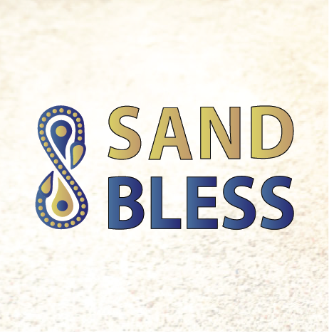

<p align="left" >
  
</p>

# Sand Bless Unction

## Bless your artwork using owned crypto-marks

[](https://www.youtube.com/watch?v=GHVNlfp4FPI)

## Inspiration

- **Machines vs Humans work**  

How to valorise and not vaporize men and women with the emergence of automation and machine productivity ?  

Where to pursue the “march of progress” ?

Craftsmen artworks will always be more expensive than machining products but we must engrave a new narrative.  
Can we use cutting edge crypto to derail and redistribute the cards' chains of values?  
How to differentiate, from an end user perspective, machining products from artwork ones?  
We must promote and expand de-anonymization of goods.  
Creation of a digital reference that can create a breadcrumb trail between producers and consumers, work, worker and work fruits.  
Sharing values, expectations, compliments and feedback.

- **Immaterial values**  

Imagine, as a stonemason, I can hand-made stone cutting your entrance house.  
Which design do you like ? Which culture or part of history do you prefer ?  
I can make a similar architecture style to fulfill your taste with a breadcrumb trail created. Which music do you like?  
I can listen to it while producing work, artwork for you, and impregnate the vibe you like into the realization.  
Adding immaterial values. Machines can't do that.
 
Story, storytelling, told work stories. Sealed a work story. Immaterial values, links and bridges.

- **From steganographic to cryptographic marks**  

Where to begin ?  Marks. Mark of the shop. Marks on artwork and products. 

Ancient cathedral builders used to engrave lapidary marks on stone to identify their tasks and atelier. Can we imagine XXieme lapidary marks ? From ancient steganographic techniques to modern public and transparent cryptographic techniques. 

A digital mark to engrave on your physical artwork. 

- **Marks as a service, self-owned and public**  

As a Craftsman, I do not want intermediaries to store and maintain ledger of my products and artwork references. But I also do not want an IT infrastructure to maintain, servers, databases resources, website, backup etc ...

The ideal is a public anchor. Simple. Secured. Personal. With no login passwords. Independent from external services. Visible on public ledger with time and tamper cryptographic proofs. 
Internet computer, Dfinity canisters, 100% on chain, check all the boxes.

- **Who are we**  

We try to use technology where it makes sense.  
Machining signatures and crypto-tech marks to valorise manual work and human values. This is what we strive to do.  
We are two ingenious/engineers/entrepreneurs, Nour and Francois, longing for innovation and social impact. Let’s present to you what we have developed, ... so far...

## What it does

The website allows all craftsmen to generate a unique mark to be tagged on their artworks.  
The best way to tag this mark is to sand blast it.   
You can sandblast on glass, wood, clay, metal etc ...
It is like a blessing part of your finished work, ready for its sale and customers' diaspora journey. The signature phase. Signature is a common universal phase of mankind creation. At least since reinforcement of properties since  Hume, Locke, Smith theories...

This mark adds a physical reference linked to a digital representation of the work and the worker creation.  
This action of adding digital reference on the physical creation is what we call **“unction”.**  
**Blessing**, unction and as the favored  technique is **sand blasting**, the name of this project became :  

**Sand Bless Unction : “Bless your artwork using owned-crypto marks.”**

Here the workflow process to use the website :

- **Enter Sand Bless ceremony**  

To generate marks you need to be identified.  
To do so, we used  [Internet Identity](https://internetcomputer.org/docs/current/tokenomics/identity-auth/what-is-ic-identity/). It can be secure using multiple device and using hard wallet for instance.

- **Gift of prayer**  

When you are logged in with internet identity, the ceremony of creating marks can start. Logged, you are named Sand Bless Priest in the website to add fun and blessing perspective of this action. The generation of a unique mark is called "gift of prayer" in our imaginary blessing scenario.

- **Unction sandblasting ritual**  

Then you can tag the mark, unction, the sandblasting ritual, to create this bridge between physical and digital representation. Polymorphic, physical & digital, a new artwork is created, in a sense.

- **On chain faith** 

When you tag the QR code on the physical, you are redirected to the front-end canister where you can check existence and last ownership.
In the website, you can retrieve all your marks by searching with your identity ID.
You can also search existence and ownership of mark by mark ID.
Those search functionalities are available for all public, without login. 

- **Sand Bless Unction Credo**  

To sum up the how-to usage for the sand bless unction utility website is :  
 1. Enter Sand Bless ceremony : login with Internet Identity
 2. Gift of prayer : receive a unique blessed mark to tag your artwork
 3. Unction ritual : sand blast QR code mark on your artwork
 4. On chain faith: check artwork QR code mark existence and ownership

## How we built it

- **on chain**  

We start from [svelte-motoko-starter kit](https://github.com/dfinity/examples/tree/master/svelte-motoko-starter).  
Then we add **NFT dip721 standard functionalities** inspired by [dip-721-nft-container mokoto example](https://github.com/dfinity/examples/tree/master/motoko/dip-721-nft-container).
We decide to remove the guardians users rights to allow all, not anonymous, identity to mint dip721 token representing their unique mark needing to tag on their artwork.
The dip721 collection is named “Sand Bless Unction” and the dip 721 symbol is "SBU".
We develop locally the 2 canisters then push it to production:

[Frontend canister](https://qob3k-7yaaa-aaaao-aahdq-cai.ic0.app/)

[Backend canister](https://a4gq6-oaaaa-aaaab-qaa4q-cai.raw.ic0.app/?id=qja56-saaaa-aaaao-aahda-cai)  

We create [sandblessunction.com](http://www.sandblessunction.com); redirecting to the frontend canister.

- **off chain**  

To tag the mark on artwork, we use : 
- A printer.
- Transparent sheets
- Self-Stick photo-resist films
- UV-Exposure Unit with vacuum
- Jet-washer to reveal on film 
- Sandblasting cabinet with air compressor.

 You can see all machines operating in the video.

## Challenges we ran into

- **Challenges "on chain" we ran into**  

**Versioning**  

It was quite difficult to harmonize all versions of Dfinity components and resources found to setup and build a local environment :

- Last ```dfx``` sdk and version used on example projects may reserve [some surprises](https://github.com/dfinity/examples/issues/249).
- ```node js``` to build internet identity repository to simulate a local  internet identity, was not the same as the ```node js```  that was working to build svelte-motoko-starter example. At some point, the local dfinity cache and ```dfx start --clean``` was not enough to restore things. A brutal ```rm -rf .dfx``` was the solution. But it is good to learn along the way. With these errors, it is a good way to understand and see how it works under the hood.

**Dfinity cycle**  

I was not  possible to obtain with dfinity faucet. So, I dissolve some ICP to have cycle to use for production deployment.

**Bug in Motoko dip-721-nft-container example ?**  

At some point our frontend starts to show that an identity has "stolen" another mark from another identity. After investigation, it may be an issue in the Motoko dip-721-nft-container backend example.
The proposed [fix in this PR](https://github.com/dfinity/examples/pull/273 ) solves our ownership jungle problems and worries. 

- **Challenges "off chain" we ran into**  

**QR Code format**

It was a challenge to find the correct size of the QR code to be printed on a bottle. If too small, sandblasting cannot be performed with enough details, if too big, the round bottle deforms the QR code shape and scan do not work properly. This is why in the video you see several  QR code on a bottle to find the best QR code size. At the beginning of tests, an exotic QR code design was used, but it was too difficult to scan.

**Sandblasting on different supports.**  

Sandblasting on different materials required to adapt the film size used ( 3, 4, 5 mm) and also QR code size. Abrasive to use and exposition duration is also an expertise to build.

**Copy and counterfeit ?**  

This project does not pretend to solve counterfeit and copy problems. We know that it is a real problem and whatever techniques, we think this problem will remain. But here our position and proposal here is :  
 
_Copy ? Yes, copy me. I do not care. It will increase the reputation of my atelier as long as your are speaking of me and I can prove that I am the first creator of this identity._

Expert and observed quality will still be necessary to tackle and discover counterfeit.

## Accomplishments that we're proud of

Successfully put all pieces, on chain and off chain, together to produce a concrete crypto and blockchain use case.  
Bridge the physical and digital world.  
Use Dfinity ability to produce and replace IT frontend and backend infrastructure, with secure and temper proof guarantee, in a small, but concrete, craftsmanship needs.
Use a new technology to highlight artwork and valorise craftsmanship. 
Testing solution validity on several materials, mainly glass, where it can be easily commercialized.

## What we learned
Based on the overcome challenges, we learn to dive into svelte framework, usage of motoko and dfinity internet identity.
We also explore sandblasting techniques and what it is technically possible in terms of size format and surface support to elaborate a better commercial offer in the future. 

## What's next for Sand Bless Unction

- Improve QR code design with possible logos customization.

- Develop on this initial root code base, with initial pilot users, to respond as much as possible as daily life craftsmanship needs.

- Then, we will target a branding campaign allowing artists, artisans and manufactures to personalize their work while pinpointing their own identity, making their products or pieces unique.  
Introducing the project to different sectors. Explore several contexts for artists, craftsmen or production ( wine ...).

- We plan also to exchange with certification industry experts to nourish our solution with best practice in terms of recovery mechanism or legal requirements and copyrights.

- Study and work on social or professional internet identity recovery mechanisms (guardians ? ) for a transparent usage in craftsmanship business operations.

We envision also new features with an accurate usage of metadata offered by the dip721 NFT standard, for instance  :

- Implement transfer of marks and build front end interface to visualize artwork ownership history. From creator to collectors.

- Adding photos by the current user, reducing the counterfeit thanks to the story and the breadcrumb trail of the created artwork. 

- Play with this ownership history in this [new playground for artwork as glimpsed at this TEDX](http://francoisbranciard.com/blog/blockchain-a-new-playground-for-artwork) few years ago, before NFT hype.

- Study [DAB solution](https://github.com/Psychedelic/DAB-js) integration to support several NFT standards.

Thats all folks, dear reader, thank you for your attention, may the Sand Bless Unction be with you.

## Install dependencies

Make sure you have [node.js](https://nodejs.org/) installed.

### DFX

Install `dfx` by running

```
sh -ci "$(curl -fsSL https://smartcontracts.org/install.sh)"
```

### Rust

To compile a local version of Internet Identity, you need to have [Rust](https://www.rust-lang.org/learn/get-started) installed.

Also install that target `wasm32-unknown-unknown` by running the command:

```
rustup target add wasm32-unknown-unknown
```

## Start the local replica

Open a new terminal window _in the project directory_, and run the following command to start the local replica. The replica will not start unless `dfx.json` exists in the current directory.

```
dfx start --background
```

When you're done with development, or you're switching to a different dfx project, running

```
dfx stop
```

from the project directory will stop the local replica.

## Install Internet Identity

To use Internet Identity during development you need to have it running on your local replica. This repository includes it in a submodule.

To clone the II repository, run:

```
git submodule update --init --recursive
```

When the repository is cloned, switch to its directory and install it:

(If you're running this on an M1 Mac, make sure you follow [these steps]())

```
cd internet-identity
npm install
II_FETCH_ROOT_KEY=1 dfx deploy --no-wallet --argument '(null)'
```

This will take several minutes to complete.

## Build & run the dapp

Make sure you switch back to the project root directory.

First, install the frontend dependencies by running

```
cd src/frontend
npm install
cd ..
```

To build and deploy the project run

```
dfx deploy --argument "(
  record {
    logo = record {
      logo_type = \"image/png\";
      data = \"\";
    };
    name = \"Sand Bless Unction\";
    symbol = \"SBU\";
    maxLimit = 10;
  }
)"
```

When the process completes you'll have a backend and a frontend canister running locally. To find the frontend canister's ID, run

```
dfx canister id frontend
```

It will output something similar to `rno2w-sqaaa-aaaaa-aaacq-cai`. Copy this ID and open it in the browser using `http://localhost:8000?canisterId=<canister ID>`, eg. `http://localhost:8000?canisterId=rno2w-sqaaa-aaaaa-aaacq-cai`.

## Local development

During local development you will be building and deploying the Motoko backend to the local replica. Building the backend will generate so called declaration files, that are Candid and JavaScript files helping the frontend communicate to the back end.

### Motoko back end

If you're using Visual Studio Code it is recommended to use the [Motoko extension](https://marketplace.visualstudio.com/items?itemName=dfinity-foundation.vscode-motoko) developed by the DFINITY Foundation.

To build the backend canister and regenerate the Candid interface declaration files for the frontend run

```
dfx build backend
```

To deploy the backend canister to the local replica you have several options:

`dfx deploy backend` will upgrade your backend canister. In short, upgrading will keep the contents of the variables you marked as stable, in contrast to reinstalling, which will clear the state of your canister.

`dfx deploy backend --mode reinstall` will reinstall the backend canister clearing all existing state.

For more options and other commands see the [dfx CLI reference](https://smartcontracts.org/docs/developers-guide/cli-reference.html).

### Svelte frontend

You can serve the frontend in development mode like you normally develop a svelte app using the command

```
npm run dev
```

from the project root directory, it is not necessary to deploy it to the frontend canister during development.

## Deploying to the IC

To host the frontend and backend on the IC, you'll need to have some cycles available. Cycles pay for the execution of your app, and they are also needed to create canisters.

You can get $20 worth of cycles for free from the Cycles Faucet, if you have a GitHub account. To claim them, follow [this guide](https://smartcontracts.org/docs/quickstart/cycles-faucet.html).

You should have a canister running the cycles wallet on the IC at this point. The cycles wallet makes it easy to pay for canister creation.

You can check the balance by running

```
dfx wallet --network ic balance
```

After making sure you have cycles available you can run

```
dfx deploy --network ic --argument "(
  record {
    logo = record {
      logo_type = \"image/png\";
      data = \"\";
    };
    name = \"Sand Bless Unction\";
    symbol = \"SBU\";
    maxLimit = 10;
  }
)"
```

The command will build the project, create two new canisters on the IC and deploy both the Svelte and Motoko dapps. The command will also create a new file `canister_ids.json` which will help the dfx tool deploy to the same canisters in future updates. You can commit this file in your repository.

You can now open your Svelte app running on the IC. You can find the canister ID in the deploy command output, or use the `frontend` ID in `canister_ids.json`.

The link to your app is `<frontend canister id>.ic0.app`. For example if your `frontend` canister ID is `zixfv-4yaaa-aaaam-aaatq-cai`, your app will be at `https://zixfv-4yaaa-aaaam-aaatq-cai.ic0.app/`.
